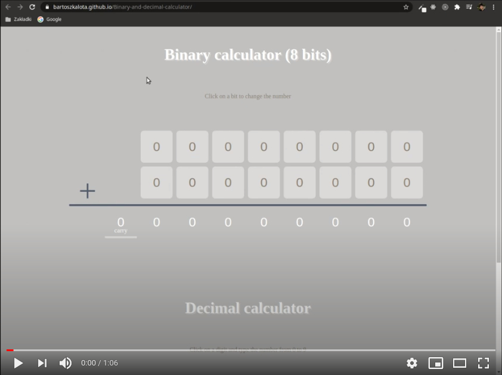

# Binary and decimal calculator (Workshop-4)
Two calculators prepared in i.a.: JS (ES6), jQuery, and SCSS as the part of the Coders Lab course.

# Live demo
https://bartoszkalota.github.io/Binary-and-decimal-calculator/

# Video demo

# Information
* The project includes two 8-digit calculators:
    * To use the **binary calculator** you just click on a bit to change the number.
    * In the case of the **decimal calculator**, click on a digit and type the number from 0 to 9. Then, click the plus on the bottom left corner of the calculator.

# Technologies
* JS (ES6)
* jQuery
* SCSS
* WebPack
* HTML